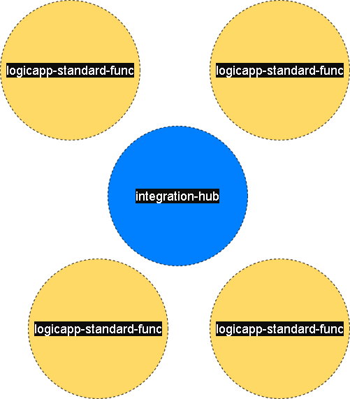
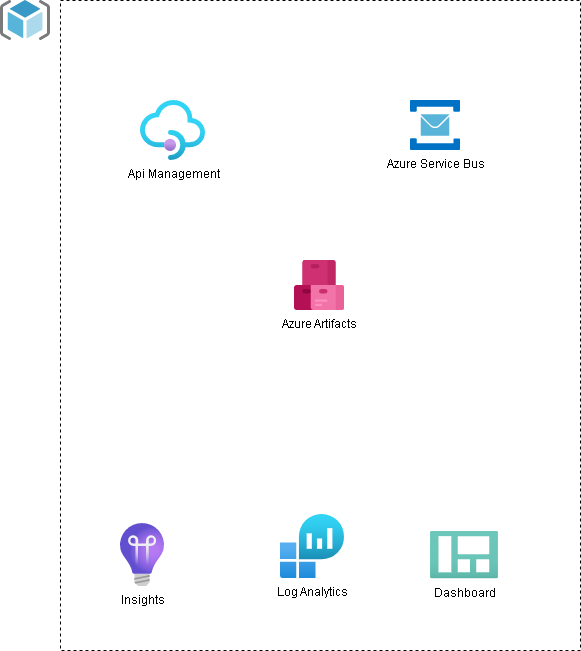
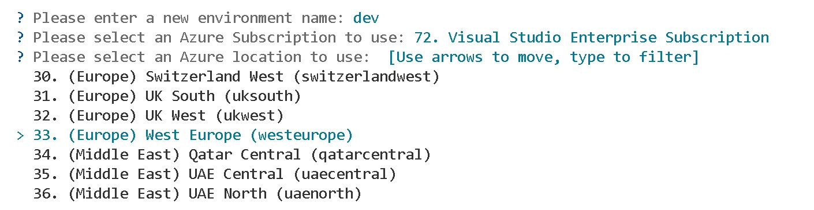
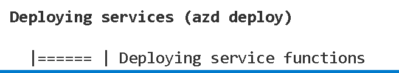

# Integration hub. There can be only one!
## "You cannot die. Accept it!"

This templates includes generic integration components like Api Management, Azure Service Bus and Azure Artifacts. 

It can be used with one or more [**logicapp-standard-func**](https://github.com/marnixcox/logicapp-standard-func/) implementations.




### Application architecture



This template utilizes the following Azure resources:

- [**Azure Monitor**](https://docs.microsoft.com/azure/azure-monitor/) for monitoring and logging
- [**Azure Key Vault**](https://docs.microsoft.com/azure/key-vault/) for securing secrets
- [**Api Management**](https://azure.microsoft.com/products/api-management/) for managing api's
- [**Azure Service Bus**](https://docs.microsoft.com/azure/service-bus/) for (reliable) messaging
- [**Azure DevOps Artifacts**](https://learn.microsoft.com/en-us/azure/devops/artifacts) for publishing libraries to


### How to get started

1. Install Visual Studio Code
1. Create a new folder and switch to it in the Terminal tab
1. Run `azd login`
1. Run `azd init -t https://github.com/marnixcox/shared-integration`

Now the magic happens. The template contents will be downloaded into your project folder. 

### Contents

The following folder structure is created. Where `corelocal` is added to extend the standard set of core infra files.

```
├── infra                      [ Infrastructure As Code files ]
│   ├── main.bicep             [ Main infrastructure file ]
│   ├── main.parameters.json   [ Parameters file ]
│   ├── app                    [ Infra files specifically added for this template ]
│   ├── core                   [ Full set of infra files provided by AzdCli team ]
│   └── corelocal              [ Extension on original core files to enable private endpoint functionality ]
├── src                        [ Application code ]
│   ├── model                  [ NuGet package for (service bus) message definitions ]
│   └── library                [ NuGet package for useful code ]
└── azure.yaml                 [ Describes the app and type of Azure resources ]

```

### Provision Infrastructure 

Let's first provision the infra components. 

- Run `azd provision`

First time an environment name, subscription and location need to be selected. These will then be stored in the `.azure` folder.



Resource group and all components will be created.


### Deploy Contents 

After coding some functions and creating Azure Logic App Standard workflows these can be deployed with another single command.

- Run `azd deploy`

Functions code and workflows will be deployed into the existing infra components.



### Azure Artifacts

The `.azdo/pipelines` folder contains a `nuget-dev-yml` pipeline. This will publish the `src/model` and `src/library` to the Azure DevOps Artifacts feed.


