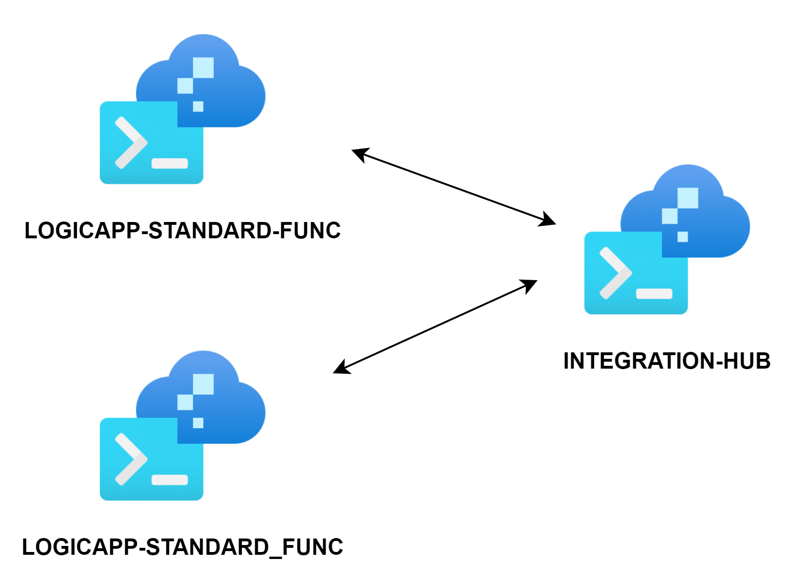
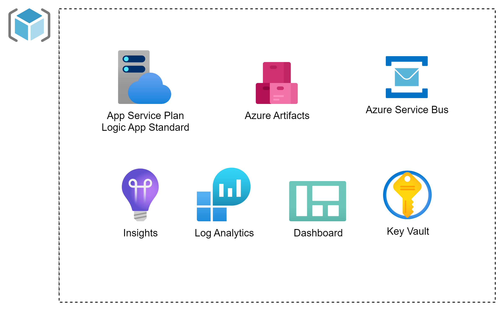
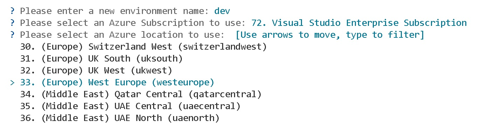

# Integration Hub
### template to deploy shared components for an integration platform

This template includes generic integration components like a shared Logic App Standard Plan, Azure Service Bus and Azure Artifacts. 

It can be used together with one or more [**logicapp-standard-func**](https://github.com/marnixcox/logicapp-standard-func/) implementations to implement an application integration platform.




### Application architecture



This template utilizes the following Azure resources:

- [**Azure Monitor**](https://docs.microsoft.com/azure/azure-monitor/) for monitoring and logging
- [**Azure Key Vault**](https://docs.microsoft.com/azure/key-vault/) for securing secrets
- [**Azure Service Bus**](https://docs.microsoft.com/azure/service-bus/) for (reliable) messaging
- [**Azure Artifacts**](https://learn.microsoft.com/en-us/azure/devops/artifacts) for publishing libraries to
- [**Azure Logic App Standard**](https://docs.microsoft.com/azure/logic-apps/) to host workflows


### How to get started

1. Install Visual Studio Code
1. Create a new folder and switch to it in the Terminal tab
1. Run `azd auth login`
1. Run `azd init -t https://github.com/marnixcox/integration-hub`

Now the magic happens. The template contents will be downloaded into your project folder. 

### Contents

The following folder structure is created. 

```
├── infra                      [ Infrastructure As Code files ]
│   ├── keyvault               [ Key Vault files ]
│   ├── logicapp               [ Logic app files ]
│   ├── servicebus             [ Servicebus files ]
│   ├── main.bicep             [ Main infrastructure file ]
│   └── main.parameters.json   [ Parameters file ]
├── scripts                    [ Scripts to package and publish NuGet packages ]
├── src                        [ Application code ]
│   ├── model                  [ NuGet package for (service bus) message definitions ]
│   └── library                [ NuGet package for useful code ]
└── azure.yaml                 [ Describes the app and type of Azure resources ]

```

### Key Infrastructure Files
- `keyvault/keyvault.bicep` - Key Vault
- `logicapp/plan.bicep` - Logic App Plan 
- `servicebus/servicebus.bicep` - Service Bus
- `main.bicep` - Main orchestration
- `monitoring.bicep` - Observability stack
- `resources.bicep` - Resource collection


### Prerequisites

- Install [.NET framework 8](https://dotnet.microsoft.com/en-us/download/dotnet/thank-you/sdk-8.0.204-windows-x64-installer)
- Install Powershell: `winget install Microsoft.PowerShell`
- Set execution policy for Powershell: [set-executionpolicy remotesigned](https://learn.microsoft.com/en-us/powershell/module/microsoft.powershell.security/set-executionpolicy) running the command as an administrator
- Install [Azure Artifacts Credential Provider](https://github.com/marnixcox/integration-hub/blob/main/scripts/installcredprovider.ps1)


### Azure Artifacts 

First configure [**Azure Artifacts**](https://learn.microsoft.com/en-us/azure/devops/artifacts/start-using-azure-artifacts) and create a feed. Enter the feed parameters in `/scripts/nuget.ps1`

`$env:ORG_NAME`
`$env:PROJECT_NAME`
`$env:FEED_NAME`

This script will run locally during development after `azd provision`. This will be skipped in the DevOps pipelines as they run in ubuntu. 

### Provision Infrastructure 

Let's first provision the infra components. Add a `resourceToken` parameter to the `main.parameters.json` to set the application name or leave it out to have a random name generated.

```
 "resourceToken": {
      "value": "appname"
    }
```

- Run `azd provision`

#### Environment

First time an environment name, subscription and location need to be selected. These will then be stored in the `.azure` folder.

Allowed values for environment are `dev` `tst` `acc` `prd`



Resource group and all components will be created.


### Deployment pipelines

This template includes pipelines for a `build once, deploy everywhere` pattern. Make sure to update the `serviceConnection` and  `AZURE_SUBSCRIPTION_ID` accordingly. 

- `main.yml` - Branch trigger 
- `validate.yml` - Validate infra code
- `package.yml` - Package src code
- `provision.yml` - Provision infra
- `deploy.yml` - Deploy src
